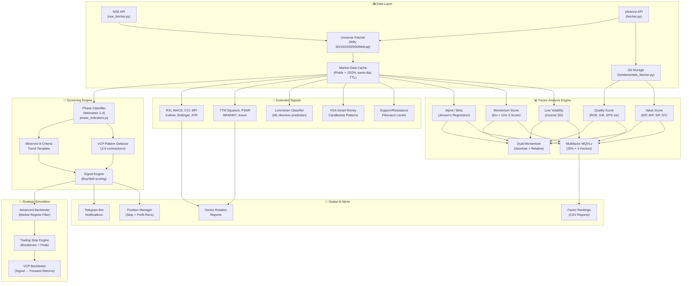
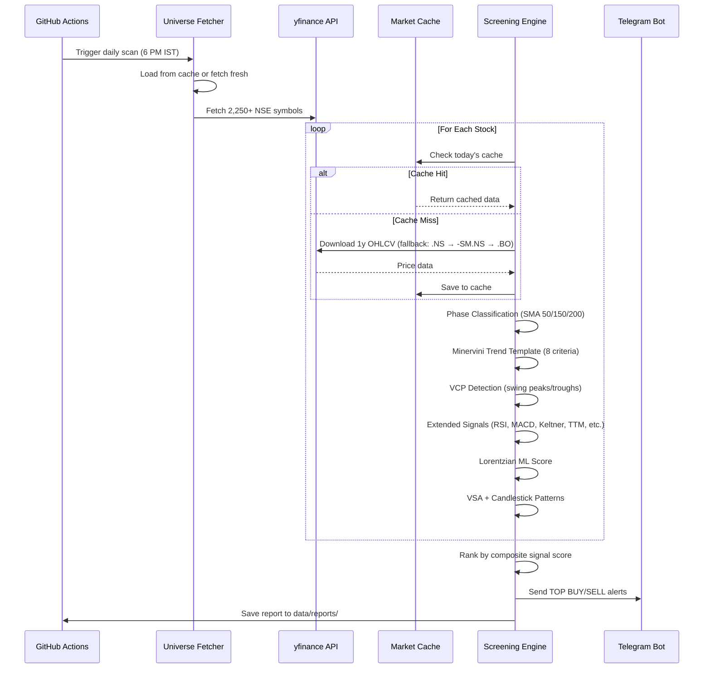
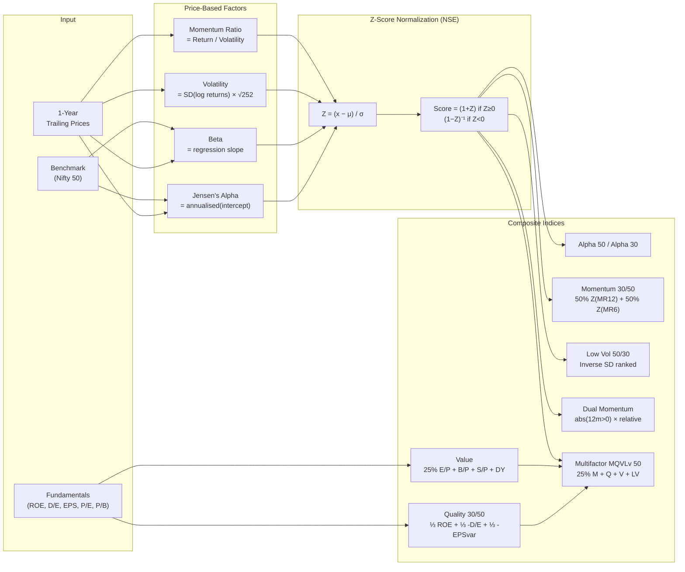
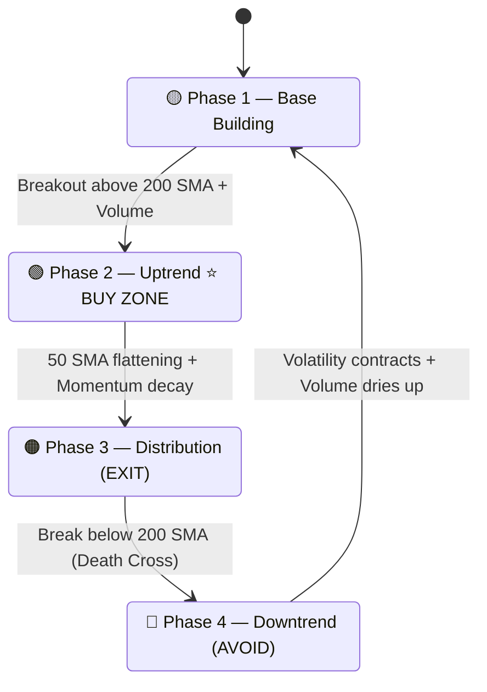
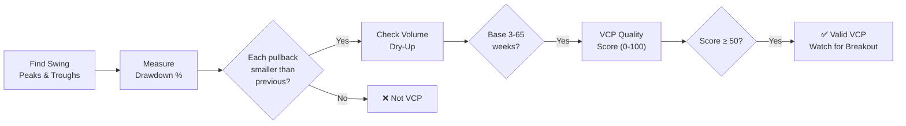
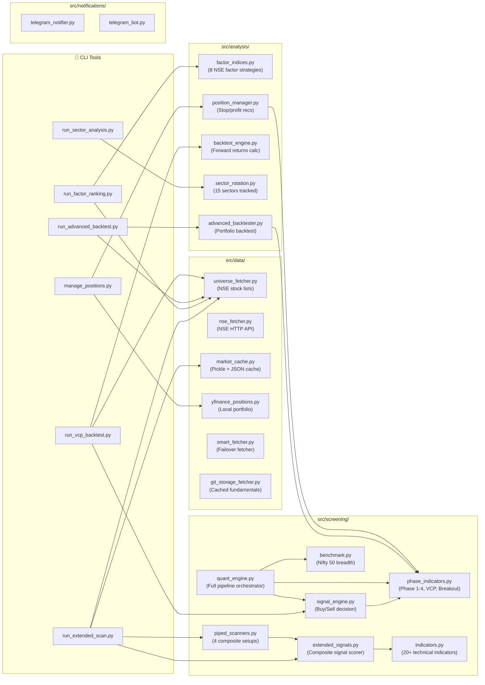
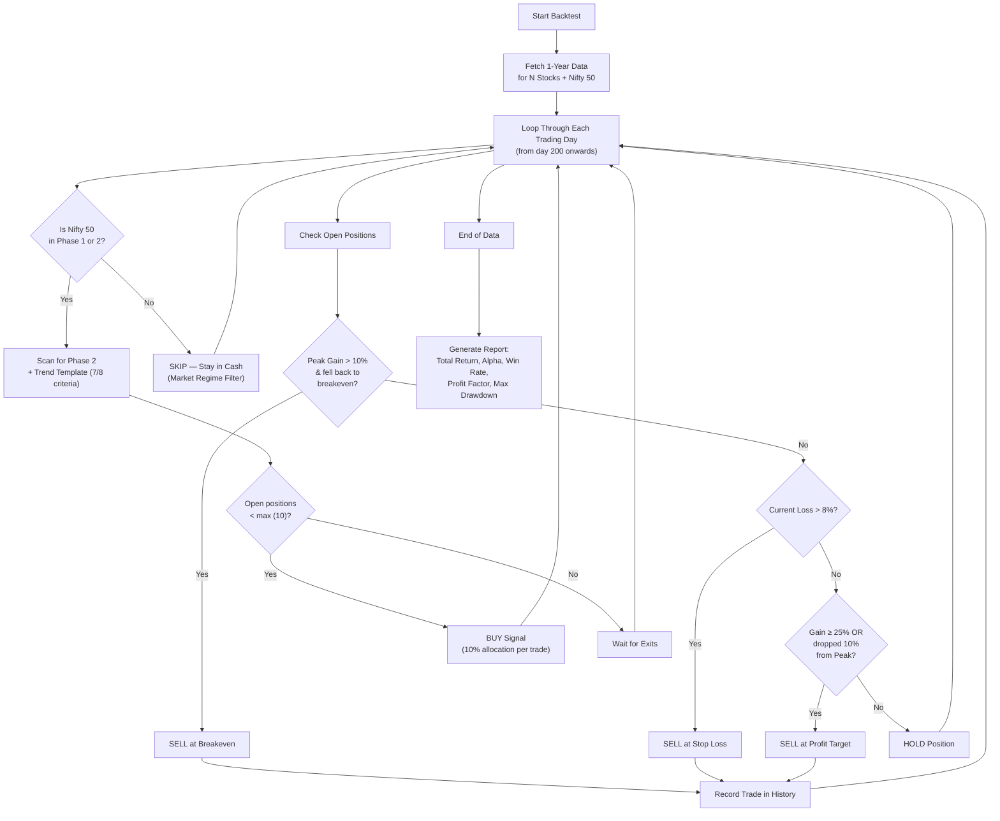

# 🚀 Alpha Capital Intelligence: NSE India Quant Suite

> **A professional-grade systematic screening, factor analysis, and backtesting platform for the Indian Stock Market. Powered by Minervini's SEPA® methodology, NSE Factor Indices, Lorentzian ML classification, and automated risk management.**

---

## 📖 What This System Does

*   **Screens 2,250+ NSE Stocks Daily** via GitHub Actions with multi-layer ticker fallback (`.NS`, `-SM.NS`, `.BO`).
*   **Minervini SEPA® Trend Template**: 8-criteria filter identifying Phase 2 breakouts where institutional money is driving prices.
*   **Volatility Contraction Pattern (VCP)** detection: Finds 2-6 progressively tighter consolidations with volume dry-up before breakout.
*   **20+ Extended Technical Signals**: RSI, MACD, CCI, MFI, Keltner Channels, TTM Squeeze, Parabolic SAR, Aroon, Bollinger Bands, NR4/NR7, Inside Bars, Fibonacci retracements, candlestick patterns, VSA (Volume Spread Analysis), and higher-high/higher-low trend detection.
*   **Lorentzian ML Classification**: KNN-inspired distance-based momentum scoring for next-day direction prediction.
*   **NSE Factor Index Rankings**: Alpha 50, Momentum 30/50, Low Volatility 50, High Beta 50, Quality 30, Value, Dual Momentum, and Multifactor MQVLv — all per NSE Feb 2026 methodology.
*   **Sector Rotation Analysis**: Tracks institutional money flow across 15 NSE sectoral indices with Relative Strength slopes.
*   **Automated Regime Detection**: 7-layer probabilistic system using Gaussian Mixture Models (GMM) to identify market states (Bullish, Sideways, Volatile, Crisis).
*   **Adaptive Strategy Allocation**: Markov-inspired meta-controller that dynamically adjusts strategy weights (Momentum vs Mean Reversion) based on detected regime.
*   **High-Performance Batch Processing**: Optimized data layer with multi-threaded analysis and batch downloading for processing 2,250+ stocks in minutes.
*   **Detailed Signal Summaries**: Enhanced Telegram alerts with entry points, stop-losses, targets, and position sizing.

---

## 🏗️ System Architecture



---

## 🔄 Daily Screening Pipeline



---

## 📊 NSE Factor Index Calculation Flow



---

## 🧠 Minervini SEPA® Methodology

### The Trend Template (8 Criteria)
Buy signals only trigger when stocks pass all strict technical hurdles:

| # | Criterion | Description |
|---|-----------|-------------|
| 1 | **Price > 150 & 200 SMA** | Established long-term uptrend |
| 2 | **150 SMA > 200 SMA** | Moving averages in bullish alignment |
| 3 | **200 SMA trending up ≥ 1 month** | Verified via 20-day slope comparison |
| 4 | **50 SMA > 150 SMA** | Perfect cascading SMA configuration |
| 5 | **Price > 50 SMA** | Respecting short-term institutional support |
| 6 | **Price ≥ 30% above 52-week low** | Significant base has been built |
| 7 | **Price within 25% of 52-week high** | Near new highs, not overextended |
| 8 | **Confirmed Phase 2** (RS Slope ≥ +0.15) | Outperforming the Nifty 50 benchmark |

### Phase Classification (Stan Weinstein)



### Volatility Contraction Pattern (VCP)
The VCP Detector (`phase_indicators.py:detect_vcp_pattern`) finds Minervini's signature pattern:



**Quality factors scored**:
- Number of contractions (2-6) — 20 pts
- Volatility tightening quality — 30 pts
- Volume drying up during pullbacks — 20 pts
- Base length appropriate (3-65 weeks) — 10 pts
- Proximity to 52-week high — 20 pts

---

## ✨ Full Feature List

### 1. NSE Factor Index Rankings (8 Strategies)

| Factor | NSE Index | Methodology | Command |
|--------|-----------|-------------|---------|
| **Alpha** | Alpha 50, Alpha 30 | Jensen's Alpha vs Nifty 50 (1-year regression) | `--factor alpha` |
| **High Beta** | High Beta 50 | Regression slope vs Nifty 50 (β > 1 preferred) | `--factor beta` |
| **Low Volatility** | Low Vol 50/30 | Inverse of annualised SD of log-returns | `--factor volatility` |
| **Momentum** | Momentum 30/50 | 50% Z(MR12) + 50% Z(MR6), normalised | `--factor momentum` |
| **Dual Momentum** | Custom | Absolute (12m > 0?) × Relative (Momentum Score) | `--factor dual_momentum` |
| **Quality** | Quality 30/50 | ⅓ Z(ROE) + ⅓ −Z(D/E) + ⅓ −Z(EPS var) | `--factor quality` |
| **Value** | Value composite | 25% each: Z(E/P), Z(B/P), Z(S/P), Z(DivYield) | `--factor value` |
| **Multifactor** | MQVLv 50 | 25% Momentum + 25% Quality + 25% Value + 25% LowVol | `--factor multifactor` |

### 2. Extended Technical Signals (20+ indicators)

| Category | Indicators |
|----------|------------|
| **Momentum** | RSI (14), MFI (14), CCI (20), Lorentzian KNN Score |
| **Trend** | SMA (50/150/200), EMA (9/21), MACD (12/26/9), Parabolic SAR, Aroon |
| **Volatility** | Bollinger Bands, Keltner Channels, ATR (14), TTM Squeeze, NR4/NR7 |
| **Volume** | Volume Spike (>2x), VSA (Stopping Volume, No Demand, Effort vs Result) |
| **Price Pattern** | Inside Bar, Higher-High/Higher-Low, 52-Week Breakout |
| **Candlestick** | Bullish/Bearish Engulfing, Hammer, Shooting Star, Morning Star |
| **Levels** | Support/Resistance, Fibonacci Retracements (0.236–0.786) |
| **Divergence** | RSI Bullish/Bearish Divergence (40-day swing comparison) |
| **Crossovers** | Golden Cross, Death Cross, 9/21 EMA Cross |
| **AI / ML** | Lorentzian Classifier (weighted ensemble), Next Day Prediction |

### 3. Piped Scanners (Composite Setups)

| Pipe # | Setup Name | Trigger Conditions |
|--------|------------|-------------------|
| 1 | **High Volume Momentum Breakout** | Volume Breakout + RSI condition + 52-Week High |
| 2 | **VCP & Chart Pattern Setup** | VCP or Narrow Range + Support Zone |
| 3 | **Institutional Trend Setup** | Golden Cross + Lorentzian Bullish (>70) |
| 4 | **Mean Reversion Pivot** | RSI Divergence + Candlestick Reversal Pattern |

### 4. Sector Rotation Monitor
Tracks **15 NSE sectoral indices**:
Banking, IT, Pharma, Auto, FMCG, Metal, Realty, Energy, Infrastructure, PSU Bank, Financial Services, Media, Commodities, Services, Consumer Durables.

Scoring: `Score = 1M Perf + (RS Slope × 2) + Distance from 50 SMA`

### 5. Portfolio Intelligence
*   **Linear Stop-Loss Scaling**: Smoothly trails stops from breakeven (5%) to locked profit (40%+).
*   **Partial Profit Formula**: `Exit% = min(50, max(0, (gain - 15) × 2.5))`
*   **Phase 3/4 Warning System**: Alerts when holdings enter distribution or downtrend.
*   **Tax-Aware Filtering**: Excludes positions held > 1 year to preserve LTCG treatment.

### 6. Smart Caching Strategy (74% API Reduction)
*   **Price Data**: Same-day pickle cache at `data/market_cache/prices/`
*   **Signal Results**: Same-day JSON cache at `data/market_cache/signals/`
*   **Fundamentals**: Git-based repo with 7-day (earnings) / 90-day (standard) refresh.
*   **Universe Lists**: Daily pickle cache at `data/cache/`

---

## 🛠️ Main Tools & Commands

### 🧠 Adaptive Regime Scanner (`run_regime_scan.py`)
Fully adaptive system that changes strategy based on current market regime.
```bash
python run_regime_scan.py                           # Default scan (Nifty 200)
python run_regime_scan.py --test --index "NIFTY 50" # Test mode (20 stocks)
python run_regime_scan.py --full                    # Scan NIFTY 500 universe
```

### 📈 Primary Scanner (`run_extended_scan.py`)
The main engine for daily NSE screening with extended signals.
```bash
python run_extended_scan.py                         # Full NSE universe (default)
python run_extended_scan.py --test                  # Test scan (first 10)
python run_extended_scan.py --nifty                 # Nifty 50 only
python run_extended_scan.py --midcap                # Nifty Midcap 100
python run_extended_scan.py --smallcap              # Nifty Smallcap 100
python run_extended_scan.py --fno                   # F&O universe
python run_extended_scan.py --ipo                   # Recently listed IPOs
python run_extended_scan.py --index "NIFTY 200"     # Any specific index
python run_extended_scan.py --pipe 1                # High Volume Momentum Breakout
python run_extended_scan.py --pipe 2                # VCP & Chart Pattern Setup
python run_extended_scan.py --pipe 3                # Institutional Trend Setup
python run_extended_scan.py --pipe 4                # Mean Reversion Pivot
python run_extended_scan.py --backtest              # Include 30-day forward returns
python run_extended_scan.py --full                  # ALL NSE equities
```

### 📊 Factor Index Rankings (`run_factor_ranking.py`)
Rank stocks per official NSE factor index methodology.
```bash
python run_factor_ranking.py --factor alpha --index "NIFTY 500" --symbols 50
python run_factor_ranking.py --factor dual_momentum --index "NIFTY 200" --symbols 30
python run_factor_ranking.py --factor momentum --index "NIFTY MIDCAP 100" --symbols 50
python run_factor_ranking.py --factor volatility --index "NIFTY 500" --symbols 50
python run_factor_ranking.py --factor beta --index "NIFTY 500" --symbols 50
python run_factor_ranking.py --factor quality --index "NIFTY 100" --symbols 30
python run_factor_ranking.py --factor value --index "NIFTY 100" --symbols 30
python run_factor_ranking.py --factor multifactor --index "NIFTY 500" --symbols 50
```

### 🧪 Advanced Backtester (`run_advanced_backtest.py`)
Simulates portfolio performance with entry/exit logic.
```bash
python run_advanced_backtest.py --days 365 --nifty
python run_advanced_backtest.py --days 365 --index "NIFTY MIDCAP 100" --symbols 50
python run_advanced_backtest.py --days 730 --fno --symbols 100
```

### 📉 VCP Strategy Backtester (`run_vcp_backtest.py`)
Tests VCP+Trend Template signals from N days ago and measures forward returns.
```bash
python run_vcp_backtest.py --index "NIFTY 50" --days_ago 30
python run_vcp_backtest.py --full --test
```

### 🔄 Sector Rotation Analyzer (`run_sector_analysis.py`)
```bash
python run_sector_analysis.py --export
```

### 💼 Portfolio Intelligence (`manage_positions.py`)
```bash
python manage_positions.py --export
python manage_positions.py --entry-dates entry_dates.json
```

---

## 📂 Project Structure



---

## 📈 Backtesting Engine Architecture



---

## 🤖 Automation (GitHub Actions)

| Workflow | Schedule | Description |
|----------|----------|-------------|
| `extended_scan.yml` | Daily (6 PM IST) | Full NSE universe scan with extended signals + Telegram alerts |
| `factor_rankings.yml` | Monthly (1st) | Alpha 50, Momentum 30, Low Vol 50 rankings |
| `daily_screening_git_storage.yml` | Daily | Incremental scan with Git-cached fundamentals |

---

## ⚙️ Quick Start

### 1. Installation
```bash
git clone https://github.com/yourusername/stock-screener.git
cd stock-screener
pip install -r requirements.txt
```

### 2. Configuration (`.env`)
```env
TELEGRAM_BOT_TOKEN=your_token
TELEGRAM_CHAT_ID=your_id
```

### 3. Setup Portfolio (`data/positions.json`)
```json
[
  {"ticker": "RELIANCE.NS", "quantity": 10, "average_buy_price": 2450.0},
  {"ticker": "TCS.NS", "quantity": 5, "average_buy_price": 3400.0}
]
```

### 4. Run Your First Scan
```bash
# Quick test (10 stocks)
python run_extended_scan.py --test

# Full universe
python run_extended_scan.py

# Factor ranking
python run_factor_ranking.py --factor dual_momentum --index "NIFTY 100" --symbols 20

# Sector rotation
python run_sector_analysis.py --export

# Backtest
python run_advanced_backtest.py --days 365 --nifty
```

---

## 📦 Dependencies

| Package | Purpose |
|---------|---------|
| `yfinance` | Price data and fundamentals |
| `pandas` | Data manipulation |
| `numpy` | Numerical computation |
| `scipy` | Statistical regression (Alpha/Beta) |
| `requests` | NSE API + Telegram |

---

## 🛡️ Disclaimer

Alpha Capital Intelligence is an analysis tool only. It does **NOT** execute trades. Do not trade solely based on these signals. Systematic trading involves risk. Always consult with a qualified financial advisor and perform your own due diligence.
